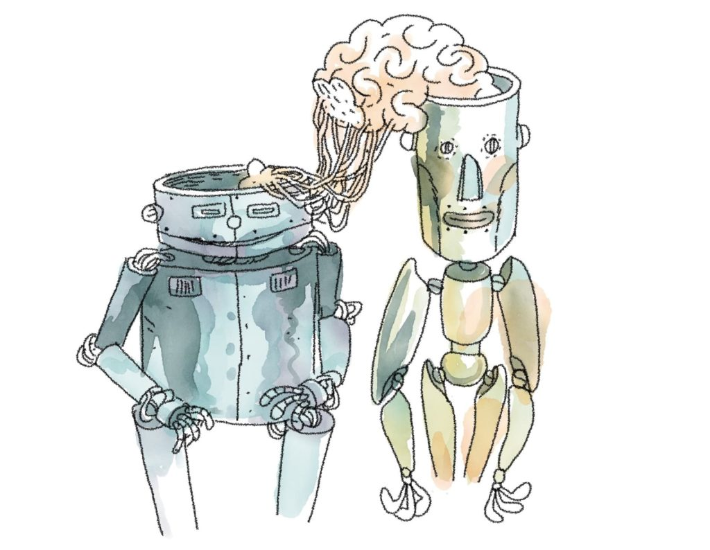
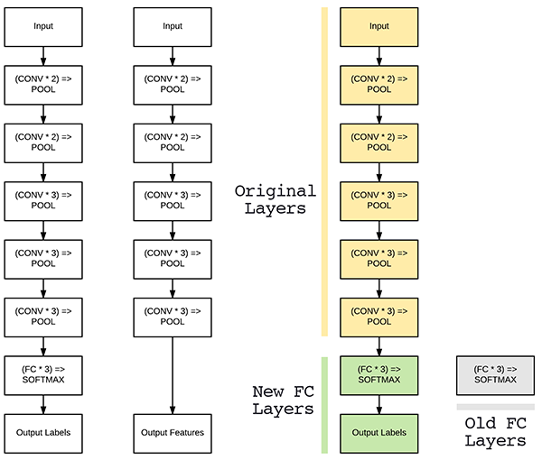

# FaceRecog_VGG

When we are creating a model in deep learning we have two problems 

1. Lots of Data Needed to train 
2. Lots of Computing Power needed

### Transfer Learning 

Adding new objects to pre trained models without starting the model creation from the begining.
It's take lot of Resources to train a model so, we use already trained weight to train our mobel.

-> In transfer Learning  the Convolutional Layer of the pre trained model is freezed.
-> We need to add a Dense layer before the layer with activation function or we can retrain the layer before activation functiom function to predict for the object we added.

### Fine Tuning

In Fine Tuning the Convolutional Layers are not freezed and the objects we added to the pretrained model is again trained and some features are extracted based on the weight alredy the model have without starting random .

